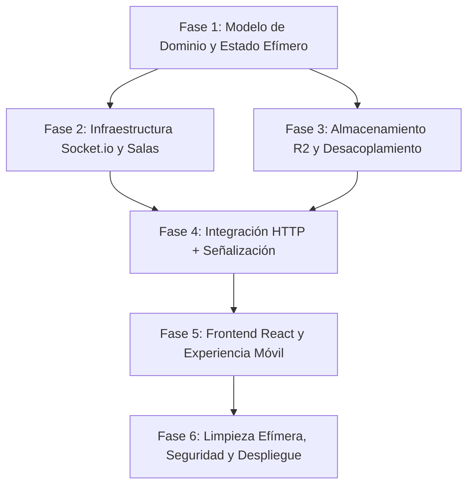

# 🧭 Roadmap de Arquitectura y Desarrollo — Dock

Bienvenido al mapa de ruta arquitectónico de **Dock**. Este documento está diseñado para guiarte paso a paso, desde los fundamentos teóricos hasta la implementación de una aplicación web escalable, ligera y desacoplada para la transferencia de archivos en tiempo real mediante salas efímeras de 4 dígitos.

---

## 🏛️ Visión General de la Arquitectura

```
                        ┌────────────────────────────────────────┐
                        │             Cliente React              │
                        │       (Móvil / Desktop / Tablet)       │
                        └───────┬────────────────────────┬───────┘
                                │                        │
                 1. HTTP POST   │                        │ 2. WebSocket
                (Multipart File)│                        │ (Señalización / Eventos)
                                ▼                        ▼
                 ┌───────────────────────────────────────────────┐
                 │                Servidor Bun                   │
                 │              (Express + Multer)               │
                 │                                               │
                 │  ┌────────────────────┐ ┌──────────────────┐  │
                 │  │   Controlador /    │ │    Socket.io     │  │
                 │  │   Rutas HTTP       │ │  (Salas 4-díg)   │  │
                 │  └─────────┬──────────┘ └────────┬─────────┘  │
                 │            │                     │            │
                 │  ┌─────────▼─────────────────────▼─────────┐  │
                 │  │      Gestor de Estado Efímero           │  │
                 │  │   (Salas, Archivos y Accesos en Memoria)│  │
                 │  └─────────────────┬───────────────────────┘  │
                 └────────────────────┼──────────────────────────┘
                                      │
                         Subida Buffer│Directo
                                      ▼
                        ┌────────────────────────┐
                        │     Cloudflare R2      │
                        │ (Almacenamiento Objeto)│
                        └────────────────────────┘
```

### Reglas de Oro Arquitectónicas
1. **Separación estricta de canales:** Los binarios viajan únicamente por **HTTP** hacia y desde Cloudflare R2. Los WebSockets (**Socket.io**) se reservan exclusivamente para señalización liviana (estados, avisos de nuevo archivo, confirmaciones de entrega y presencia en salas). Nunca satures el canal WebSocket transportando bytes de archivos.
2. **Desacoplamiento Objeto vs. Acceso:** Un archivo físico en Cloudflare R2 (`File`) es independiente del derecho de un usuario a verlo (`FileAccess` o Transacción). Esto permite:
   - Que un usuario que entra tarde a una sala no tenga acceso a archivos transferidos antes de su ingreso.
   - Reenviar un archivo existente a otra sala o participante mediante un puntero, sin duplicar almacenamiento ni consumir ancho de banda de subida.
3. **Efimeridad:** Las salas viven mientras haya usuarios conectados o expire su tiempo de vida (TTL). Los archivos cuentan con un ciclo de vida acotado para no incurrir en almacenamiento huérfano.

---

## 🗺️ Fases de Implementación

---

### Fase 1: Modelado del Dominio y Estado Efímero en Memoria

#### 1. Objetivo de la fase
Definir y encapsular las estructuras de datos que gobernarán las salas de 4 dígitos, los participantes y la separación entre **Archivos Físicos** y **Permisos de Acceso**, operando completamente en memoria del servidor sin requerir una base de datos pesada.

#### 2. Tareas técnicas paso a paso
- [ ] **Diseño del generador de códigos de sala:**
  - Crear un módulo utilitario que genere códigos alfanuméricos o numéricos de 4 dígitos (ej: `1000` a `9999` o combinaciones seguras como `A2B4`).
  - Implementar validación de colisiones: garantizar que no se asigne un código que ya esté activo.
- [ ] **Estructuración del modelo de datos:**
  - **`FileEntity`**: `{ id, storageKey, originalName, mimeType, size, createdAt }`.
  - **`FileShareTransaction`**: `{ id, fileId, roomId, senderSocketId, targetUserIds: string[], timestamp }`.
  - **`RoomEntity`**: `{ code, createdAt, members: Map<socketId, UserMetadata> }`.
- [ ] **Creación del Repositorio en Memoria (`RoomStateStore`):**
  - Implementar métodos atómicos: `createRoom()`, `joinRoom(code, user)`, `leaveRoom(code, socketId)`, `grantFileAccess(fileId, roomId, recipients)`.
  - Implementar consulta de visibilidad: método `getAccessibleFiles(socketId, roomCode)` que filtre únicamente las transacciones donde el usuario estaba presente como destinatario al momento del envío.

#### 3. Conceptos clave a entender
- **Separación de Identidad vs. Autorización:** Al registrar una subida, generamos un identificador único global (`UUID`) para el blob almacenado en R2. Por separado, registramos una tupla de concesión `(fileId, recipientUserId, timestamp)`. Si el usuario B entra 10 segundos después del envío, dicha tupla no contendrá su identificador, impidiendo que el backend le sirva la URL de descarga o preview.
- **In-Memory Store vs. Database:** Al tratarse de salas efímeras, mantener el estado en memoria (`Map` y estructuras nativas de JS/TypeScript) garantiza latencias de microsegundos y simplifica la infraestructura, evitando la sobrecarga de un motor SQL o NoSQL para sesiones cortas.

#### 4. Qué debo leer / Documentación recomendada
- **JavaScript `Map` and `Set` Performance:** [MDN Web Docs — Map](https://developer.mozilla.org/en-US/docs/Web/JavaScript/Reference/Global_Objects/Map) (comprender por qué las búsquedas por clave `O(1)` superan a arrays lineales para listas de salas y usuarios).
- **UUID v4 RFC 4122:** Concepto de colisiones probabilísticas para nombres seguros de almacenamiento.

#### 5. Criterio de validación
- Ejecutar un test unitario o script de prueba en Node/Bun donde:
  1. Se crea la sala `1234` con el usuario Alice.
  2. Se registra un archivo compartido por Alice para todos los miembros actuales (solo Alice).
  3. Ingresa el usuario Bob a la sala `1234`.
  4. La función `getAccessibleFiles(Bob)` devuelve una lista vacía `[]`, mientras que `getAccessibleFiles(Alice)` devuelve el archivo.

---

### Fase 2: Infraestructura en Tiempo Real con Socket.io

#### 2. Objetivo de la fase
Montar el servidor de WebSockets sincronizado con Express para gestionar el ciclo de vida de las salas de 4 dígitos, control de presencia, desconexiones limpias y eventos de señalización.

#### 2. Tareas técnicas paso a paso
- [ ] **Configurar Socket.io sobre el servidor HTTP:**
  - Integrar `Server` de `socket.io` adjunto a la instancia HTTP de Express en `server/index.js`.
  - Configurar políticas de CORS estrictas pero accesibles para la red local (compatibilidad con móviles).
- [ ] **Implementar el controlador de eventos de sala:**
  - Evento `room:create`: genera un código no ocupado, inscribe al creador y emite el código generado.
  - Evento `room:join`: valida existencia de la sala, agrega al socket a la sala de Socket.io (`socket.join(roomCode)`) y notifica a los demás participantes (`room:user_joined`).
  - Evento `disconnecting` / `disconnect`: detecta qué salas abandona el socket; si la sala queda con 0 integrantes, programa o ejecuta la purga de la misma.
- [ ] **Manejo de identidad de sesión efímera:**
  - Asignar a cada cliente un `userId` o `alias` opcional persistido en memoria de sesión o `sessionStorage` para reconexiones rápidas.

#### 3. Conceptos clave a entender
- **Rooms de Socket.io:** Socket.io implementa internamente el patrón Pub/Sub mediante "Rooms". Al invocar `socket.join(code)`, la instancia del socket se suscribe a un canal en memoria. Cuando alguien comparte un archivo, el servidor puede emitir a `io.to(code).emit(...)` o excluir al emisor con `socket.to(code).emit(...)`.
- **Heartbeats y ciclo de vida de conexiones volátiles:** En redes móviles (Wi-Fi a 4G o suspensiones de pantalla), los sockets suelen cerrarse abruptamente. El evento `disconnect` permite limpiar referencias huérfanas sin bloquear recursos en el backend.

#### 4. Qué debo leer / Documentación recomendada
- **Documentación oficial de Socket.io:** [Socket.io Rooms Documentation](https://socket.io/docs/v4/rooms/) y [Emit cheatsheet](https://socket.io/docs/v4/emit-cheatsheet/).
- **WebSockets vs HTTP Polling:** Ventajas de la conexión bidireccional continua de baja latencia para señalización de eventos.

#### 5. Criterio de validación
- Abrir dos pestañas del navegador (o una en PC y otra en el celular):
  1. La pestaña A crea una sala y obtiene el código `4821`.
  2. La pestaña B se une al código `4821`.
  3. La pestaña A recibe inmediatamente el evento `room:user_joined` con los datos de B.
  4. Al cerrar la pestaña B, la pestaña A recibe en menos de 2 segundos la notificación de salida.

---

### Fase 3: Capa de Almacenamiento R2 y Desacoplamiento de Archivos

#### 1. Objetivo de la fase
Reestructurar la subida y entrega de archivos mediante Cloudflare R2, asegurando que los archivos físicos tengan un identificador inmutable, nombres higienizados y soporte para streaming en memoria sin saturar disco.

#### 2. Tareas técnicas paso a paso
- [ ] **Aislar la capa de R2 (`services/storageService.js`):**
  - Implementar `uploadBlob({ key, buffer, mimeType })` usando `PutObjectCommand`.
  - Asegurar la inclusión de headers HTTP apropiados (`ContentType`, `ContentDisposition`) para que el navegador decida correctamente si renderiza la imagen o fuerza la descarga.
- [ ] **Pipeline de subida con Multer en memoria:**
  - Configurar `multer({ storage: multer.memoryStorage(), limits: { fileSize: 50 * 1024 * 1024 } })` (ej. límite de 50MB por archivo).
  - Implementar middleware de captura de errores de Multer para evitar caídas del servidor por exceder el tamaño límite.
- [ ] **Separación del File Registry y resolución de URL:**
  - Cuando se sube un archivo físico, guardarlo bajo una clave única en R2: `uploads/{uuid}-{sanitizedName}`.
  - Almacenar el registro en el `FileStateStore` asociándolo a su autor original.
- [ ] **Endpoint de reenvío/reutilización (`POST /files/forward`):**
  - Permitir que un usuario que ya tiene acceso a un `fileId` existente solicite compartirlo con una nueva sala o usuario sin volver a subir los bytes.

#### 3. Conceptos clave a entender
- **¿Por qué `memoryStorage` en Multer y cuándo evitarlo?**
  - `memoryStorage` guarda el archivo entrante directamente como un `Buffer` en la memoria RAM del proceso Bun/Node. Esto elimina lecturas/escrituras en disco rígido, acelerando la transferencia inmediata hacia Cloudflare R2.
  - *Criterio de arquitectura:* Funciona excelente para archivos pequeños y medianos (< 50MB). Para archivos de gigabytes, se prefieren URLs prefirmadas directas cliente-R2 para no saturar la RAM del servidor.
- **Inmutabilidad del Blob:** Al almacenar el archivo con un UUID único en R2, evitamos sobreescrituras si dos usuarios suben un archivo llamado `foto.png` simultáneamente. El nombre visible por los usuarios se gestiona como metadata.

#### 4. Qué debo leer / Documentación recomendada
- **AWS SDK for JavaScript v3 (S3 Client):** [PutObjectCommand Reference](https://docs.aws.amazon.com/AWSJavaScriptSDK/v3/latest/clients/client-s3/classes/putobjectcommand.html).
- **Multer Memory vs Disk Storage:** [Multer Storage Engines](https://github.com/expressjs/multer#storage).

#### 5. Criterio de validación
- Subir mediante Postman o formulario dos archivos con el mismo nombre (`foto.png`) en diferentes momentos.
- Verificar en el bucket de Cloudflare R2 que ambos existan con claves distintas sin sobreescribirse.
- Verificar que el endpoint de reenvío cree una nueva transacción de acceso sin generar un nuevo objeto en R2.

---

### Fase 4: Integración del Flujo HTTP + Señalización Socket.io

#### 1. Objetivo de la fase
Unificar los dos canales: una vez que el archivo se sube exitosamente a través del endpoint HTTP, el servidor emite una notificación dirigida por WebSocket a los miembros autorizados de la sala.

#### 2. Tareas técnicas paso a paso
- [ ] **Orquestación en el controlador de subida:**
  - El cliente envía el archivo vía `multipart/form-data` incluyendo en los campos de texto `roomId` y su `socketId`.
  - El backend procesa la subida a R2, registra los permisos en el `RoomStateStore` (restringido a los sockets presentes en la sala en ese milisegundo).
  - El backend obtiene la instancia de Socket.io (`req.app.get('io')`) y dispara un evento `file:new` únicamente a los participantes autorizados.
- [ ] **Payload de señalización ligero:**
  - El evento `file:new` no envía el archivo, sino la metadata: `{ transactionId, fileId, name, size, isImage, url, senderId, timestamp }`.
- [ ] **Manejo de reenvío en tiempo real:**
  - El endpoint `POST /files/forward` valida los permisos del emisor, asocia los nuevos destinatarios y emite `file:new` a la sala destino.

#### 3. Conceptos clave a entender
- **Patrón Outbox / Event-Driven Notification:** La subida es asíncrona y transaccional: primero se asegura el almacenamiento físico duradero (R2) y el registro lógico; solo si la operación HTTP tiene éxito, se propaga el aviso por el bus de eventos en tiempo real.
- **Atomicidad en la lista de destinatarios:** El conjunto de usuarios que tienen derecho a ver el archivo se congela en el instante de la subida. Un usuario que emita `joinRoom` medio segundo después no recibirá el evento `file:new` ni figurará en la lista de transacciones autorizadas.

#### 4. Qué debo leer / Documentación recomendada
- **Event-Driven Architecture Basics:** Patrón de notificación de eventos con carga útil ligera (*Claim Check Pattern*).

#### 5. Criterio de validación
- Abrir dos navegadores:
  - Navegador 1 y Navegador 2 están en la sala `9999`.
  - Navegador 1 sube un PDF de 2MB.
  - Navegador 2 muestra en pantalla el nuevo archivo casi instantáneamente sin tener que recargar la página ni consultar periódicamente (sin polling).
  - Abrir un Navegador 3 y unirse a la sala `9999`. El archivo subido anteriormente **no** debe aparecer en la lista del Navegador 3.

---

### Fase 5: Experiencia de Usuario y Frontend React

#### 1. Objetivo de la fase
Construir una interfaz reactiva, moderna y adaptable a dispositivos móviles (touch-friendly), integrando conexión con Socket.io client, gestión de salas y dos paneles visuales claros: archivos enviados en la sesión y archivos recibidos en la sala.

#### 2. Tareas técnicas paso a paso
- [ ] **Gestor de Conexión Socket en React (`context` o hook personalizado `useSocket`):**
  - Inicializar la conexión una sola vez al cargar la aplicación.
  - Gestionar estados: `conectando`, `conectado`, `sala activa`, `desconectado`.
- [ ] **Pantalla de Entrada a Salas (Lobby):**
  - Selector de dos opciones claras: **Crear nueva sala** (genera código y entra de inmediato) o **Unirse con código** (input numérico de 4 dígitos autoenfocado).
  - Botón de copiado rápido y código QR opcional para que un teléfono se una en 1 segundo escaneando la pantalla de la PC.
- [ ] **Componentes de Transferencia y Visualización:**
  - **Formulario de subida:** Drag & drop o selector de archivos con barra o indicador de progreso de subida HTTP.
  - **Panel de "Archivos recién compartidos":** Feedback visual inmediato de lo que el propio usuario acaba de enviar.
  - **Panel de "Archivos recibidos":** Renderizado reactivo alimentado por el evento `file:new` de Socket.io, con tarjetas interactivas que distingan vistas previas de imágenes o botones directos de descarga para documentos.
- [ ] **Mecanismo de Reenvío en el Cliente:**
  - Botón en cada tarjeta de archivo que permita "Reenviar a otra sala" solicitando únicamente el código destino de 4 dígitos.

#### 3. Conceptos clave a entender
- **Optimistic UI vs. Event Confirmation:** Al subir un archivo, podemos mostrarlo localmente como "Enviando..." y confirmarlo cuando el servidor devuelva `200 OK`. Los destinatarios, en cambio, reaccionan puramente de forma pasiva ante el evento `file:new`.
- **Limpieza de Hooks (`useEffect` cleanup):** Desuscribir los listeners de Socket (`socket.off("file:new")`) cuando el componente se desmonte para evitar duplicación de eventos y fugas de memoria en React.

#### 4. Qué debo leer / Documentación recomendada
- **Socket.io Client API:** [Socket.io with React Guide](https://socket.io/how-to/use-with-react).
- **Tailwind CSS v4 Responsive Design:** Buenas prácticas para layouts móviles (`sm:`, `md:`, `lg:`).

#### 5. Criterio de validación
- Probar el flujo completo en un smartphone real conectado a la red local:
  - Generar código en PC.
  - Ingresar código en el celular.
  - Tomar una foto desde la cámara del celular y pulsar subir.
  - En la PC, la foto debe aparecer inmediatamente en la sección de recibidos y poder abrirse a resolución completa desde Cloudflare R2.

---

### Fase 6: Políticas de Expiración, Seguridad y Despliegue Local

#### 1. Objetivo de la fase
Garantizar que el sistema sea resistente, seguro contra abusos y que no acumule archivos huérfanos ni en la memoria del servidor ni en Cloudflare R2, dejando la aplicación lista para su despliegue local o en red compartida.

#### 2. Tareas técnicas paso a paso
- [ ] **Recolección de basura efímera (TTL Cleanup):**
  - Implementar un cron o `setInterval` en el backend (ej: cada 15 minutos) que revise salas inactivas.
  - Si una sala no tiene miembros o supera las 2 horas de vida, marcar sus transacciones como expiradas.
- [ ] **Reglas de ciclo de vida en Cloudflare R2 (Object Lifecycle):**
  - Configurar en el panel de Cloudflare R2 una regla de expiración automática de objetos (ej: borrar objetos tras 1 día o 3 días) para mantener el almacenamiento gratuito sin necesidad de scripts pesados de borrado en el servidor.
- [ ] **Seguridad y Validación de Entrada:**
  - Sanitizar nombres de archivos (eliminar caracteres especiales o rutas maliciosas tipo `../`).
  - Limitar la tasa de creación de salas para evitar saturación de memoria (Rate limiting básico en Express).
- [ ] **Configuración de red local para acceso multiplataforma:**
  - Configurar Vite para escuchar en `0.0.0.0` (`--host`).
  - Configurar CORS en Express dinámicamente o permitir la subred local (`192.168.x.x`).

#### 3. Conceptos clave a entender
- **R2 Lifecycle Rules:** Cloudflare permite definir políticas automáticas a nivel de bucket para eliminar objetos luego de $N$ días sin costo de operaciones de borrado desde el servidor. Esto asegura que la aplicación sea de "mantenimiento cero".
- **Defensa en profundidad para archivos de usuarios:** No confiar en la extensión enviada por el navegador; verificar el `mimetype` reportado por Multer y servir los archivos siempre desde un subdominio o CDN aislado (`r2.dev`) para prevenir ataques de ejecución de scripts en el mismo dominio.

#### 4. Qué debo leer / Documentación recomendada
- **Cloudflare R2 Object Lifecycle Management:** [Cloudflare Lifecycle Docs](https://developers.cloudflare.com/r2/buckets/object-lifecycles/).
- **OWASP File Upload Cheat Sheet:** [Guía de seguridad para subida de archivos](https://cheatsheetseries.owasp.org/cheatsheets/File_Upload_Cheat_Sheet.html).

#### 5. Criterio de validación
- Dejar una sala inactiva y verificar que el recolector en memoria libere las referencias.
- Validar mediante las herramientas de red de Chrome que la transferencia no exponga secretos de R2 (`AccessKey` o `SecretKey`) en el frontend, operando siempre mediante el proxy seguro del backend y la URL pública predefinida.

---

## 📊 Matriz de Dependencias entre Fases



---

## 🎯 Conclusión y Primer Paso
Para comenzar de forma sólida y ordenada:
1. Revisa las estructuras de datos de la **Fase 1**.
2. Diseña el módulo `RoomStateStore` en el backend para gestionar las salas y la matriz de visibilidad de archivos.
3. Avanza fase a fase completando los criterios de validación antes de dar el siguiente paso.
